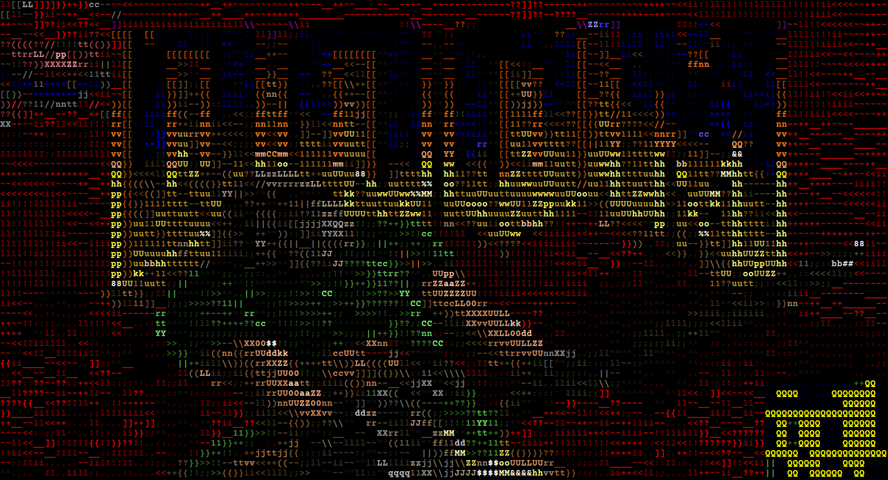

# DOOM-ASCII



**Text-based DOOM in your terminal!**

Source-port of [doomgeneric](https://github.com/ozkl/doomgeneric). Does not have sound.

You will need a WAD file (game data). If you don't own the game, the shareware version is freely available.

## Build

Binaries for Windows and Linux are provided as github releases.

### Linux
Creates ```doom_ascii/doom_ascii```
```
cd src
make
```

### Windows
Compile on linux. Creates ```doom_ascii/doom_ascii.exe```
```
cd src
make windows
```

## Controls

Default keybindings are listed below.

|Action         |Default Keybind|
|---------------|---------------|
|UP             |ARROW UP		|
|DOWN			|ARROW DOWN		|
|LEFT			|ARROW LEFT		|
|RIGHT			|ARROW RIGHT	|
|STRAFE LEFT	|,				|
|STRAFE RIGHT	|.				|
|FIRE			|SPACE			|
|USE			|E				|
|SPEED			|]				|
|WEAPON SELECT  |1-7            |

Keybinds can be remapped in ```.default.cfg```

## Performance

### Display

Most terminals aren't designed for massive throughput, so the game cannot be played at full 320x200 resolution at high frames per second.

Pass the command-line argument ```-scaling n``` to determine the level of scaling. Smaller numbers denote a larger display.

A scale of 4 is used by default, and should work flawlessly on all terminals. Most terminals (excluding Windows CMD) should manage with scales up to and including 2.

### Input
The following terminal input options are not mandatory but may improve input handling.
- Disable character repeat delay to prevent delayed repeated inputs.
- Increase polling rate to ensure input on every frame.
